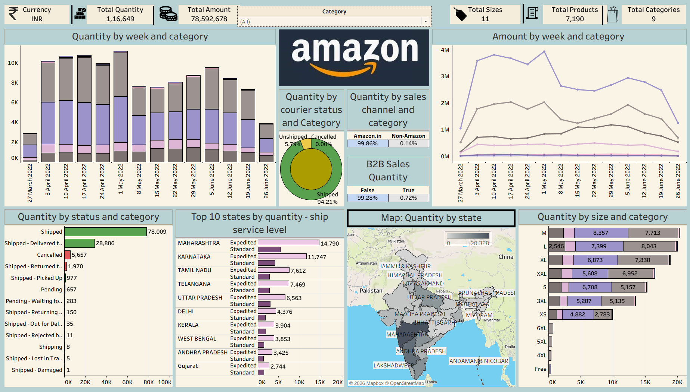

# 📊 Amazon Sales Dashboard (India)

An interactive Tableau dashboard built to analyze Amazon India sales data, providing insights into sales performance, order fulfilment, product categories, shipping trends, and regional distribution.

---

## Dashboard Preview

---

## Project Overview

This project presents an interactive Amazon India Sales Dashboard developed using Tableau. The dashboard helps analyze sales trends, product performance, shipping status, and regional sales distribution through dynamic visualizations and filters.

---

## Project Objective

The objective of this project is to transform raw Amazon sales data into meaningful business insights using Tableau. The dashboard enables users to explore sales performance, identify trends, and support data-driven decision-making.

---

## Tools Used

- Tableau Desktop
- Microsoft Excel / CSV

---

## Dataset

The dataset contains Amazon India sales transactions, including:

- Order Details
- Sales Amount
- Quantity Sold
- Product Category
- Shipping Status
- Sales Channel
- State & City Information
- Product Size

---

## Dashboard Features

- KPI Cards
- Weekly Sales Trend
- Category-wise Quantity Analysis
- Weekly Sales Amount Trend
- Order Status Analysis
- State-wise Sales Map
- Top 10 States by Quantity
- Sales by Product Size
- Sales Channel Distribution
- Courier Status Analysis
- Interactive Filters

---

## Key Insights

- Analyze weekly sales performance.
- Identify top-performing states.
- Track order fulfilment and courier status.
- Compare sales across different product categories.
- Understand product size distribution.
- Explore sales using interactive dashboard filters.

---

## Repository Contents

- `Amazon_Sales_India.twb` – Tableau Workbook
- `Amazon Sale Report.zip` – Dataset
- `Amazon_sales_dashboard.png` – Dashboard Preview
- `README.md` – Project Documentation

---

## How to Use

1. Download the repository.
2. Extract the dataset ZIP file.
3. Open `Amazon_Sales_India.twb` in Tableau Desktop.
4. If prompted, reconnect the workbook to the extracted CSV dataset.
5. Explore the interactive dashboard.

---

## Author

**Sai Likitha Madisetty**

Aspiring Data Analyst | Tableau | SQL | Excel | Python

---
